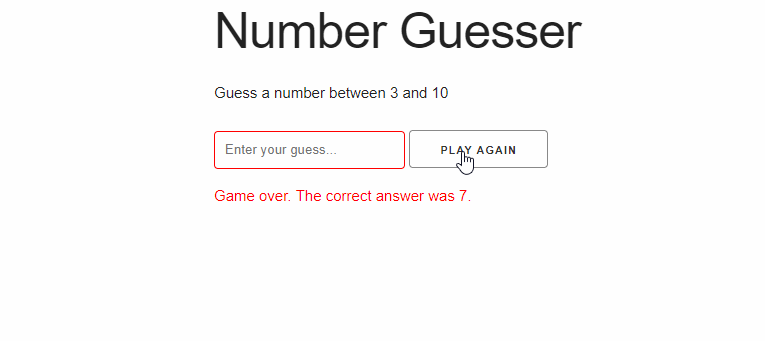

# Number-Guesser-Game
This is a number guessing game built using HTML5, CSS3, Skeleton, and vanilla Javascript

* Game randomly generates number between min and max value
* Game gives player 3 chances to guess correctly
* Messages will pop-up on each turn to indicate game status
* When game is over, user can play again

